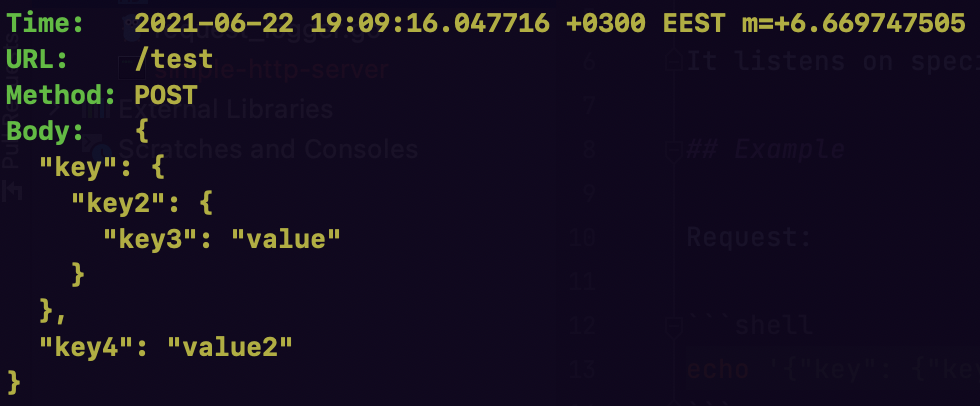

# Simple HTTP server

## About
Simple HTTP server listener written on go with JSON formatting.

It listens on specific port for HTTP requests and prints request's data into the stdout.

## Example

Request:

```shell
echo '{"key": {"key2": {"key3": "value"}}, "key4": "value2"}' | http POST :8080/test 
```

Result:



## Installation

```shell
curl -sf https://gobinaries.com/cheshir/simple-http-server | sh
```

Or if you want to build it from the source:

```shell
go install github.com/cheshir/simple-http-server
```

## Configuration

You can specify HTTP port with -p flag:

```shell
simple-http-server -p 9999
```
